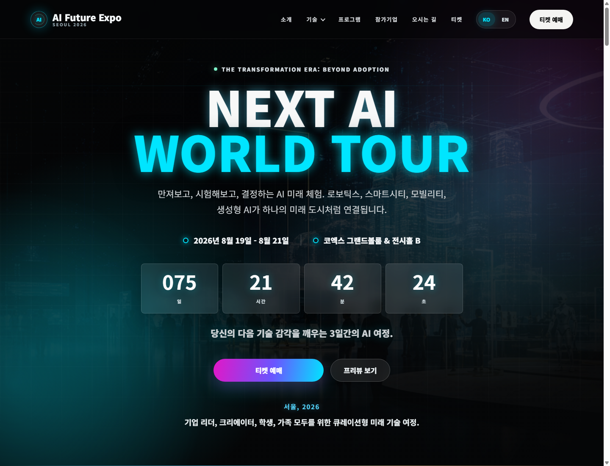
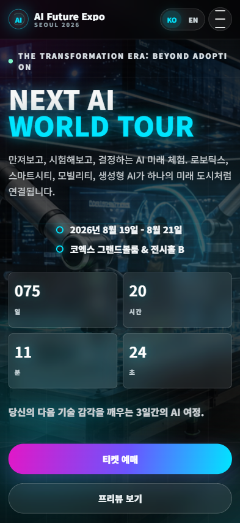
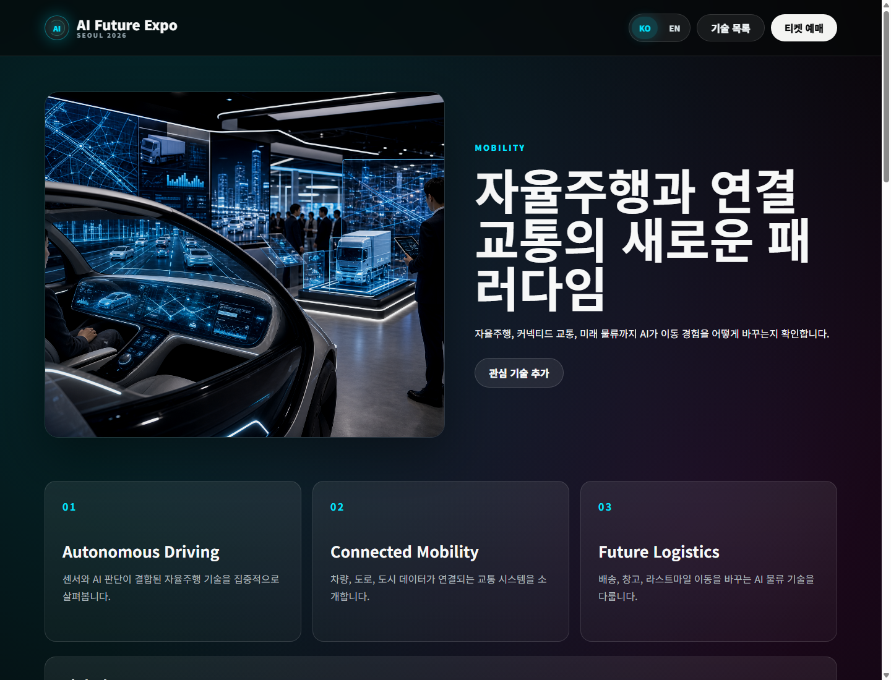
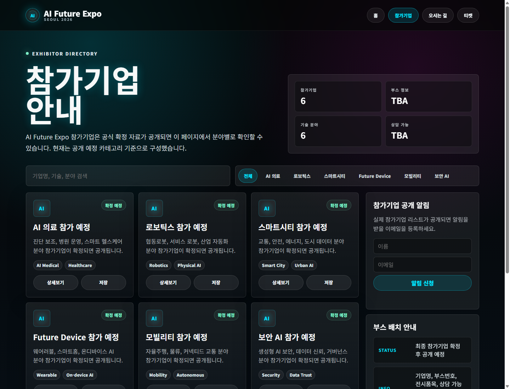

# AI Future Expo 2026

AI 기술 전시회를 콘셉트로 제작한 반응형 홍보 웹사이트입니다. 전시 소개, 기술 상세 페이지, 참가기업 안내, 티켓 예매, 오시는 길까지 하나의 정적 웹사이트로 구성했습니다.

- Live Site: https://ai-expo-sooty.vercel.app/
- Deployment: Vercel
- Type: Static website

## Preview

### Desktop



### Mobile



### Technology Detail



### Exhibitor Directory



## Project Scope

- 메인 랜딩 페이지 UI/UX 구성
- 모바일/태블릿/데스크톱 반응형 레이아웃
- 한국어/영어 언어 전환
- 기술별 상세 페이지 6종 제작
- 기술 프리뷰 영상 영역 구현
- 참가기업 디렉터리, 필터, 검색, 저장 기능
- 실제 기업 CI를 활용한 참가기업 카드 구성
- 날짜별 일반 관람권 예매 페이지와 오시는 길 페이지 구성
- 파비콘, iOS/Android 홈 화면 아이콘 적용
- Vercel 정적 배포 설정

> 참가기업과 연사 정보는 포트폴리오 시연을 위한 예시 데이터입니다. 실제 행사 참가 또는 출연을 의미하지 않습니다.

## Video Production

사이트에 포함된 메인 영상과 기술별 프리뷰 영상은 Adobe Premiere Pro와 Adobe After Effects를 사용해 직접 편집했습니다.

- 메인 홍보 영상: `videos/main-preview-updated.mp4`
- 기술별 영상: 한국어/영어 버전 분리 제공
- 각 기술 페이지에서 선택된 언어에 따라 대응되는 영상으로 전환
- 한국어 선택 시 한국어 자막과 한국어 나레이션 영상 재생
- 영어 선택 시 영어 자막과 영어 나레이션 영상 재생
- 썸네일 이미지는 기술별 분위기에 맞춰 별도 제작

## Pages

| File | Description |
| --- | --- |
| `index.html` | 메인 페이지 |
| `tech-ai-medical.html` | AI Medical 상세 |
| `tech-robotics.html` | Robotics 상세 |
| `tech-smart-city.html` | Smart City 상세 |
| `tech-future-device.html` | Future Device 상세 |
| `tech-mobility.html` | Mobility 상세 |
| `tech-cyber-ai.html` | Cyber AI 상세 |
| `exhibitors.html` | 참가기업 페이지 |
| `ticket.html` | 티켓 예매 페이지 |
| `directions.html` | 오시는 길 페이지 |

## Structure

```text
.
├── docs/
│   ├── project-plan.md  # 프로젝트 기획 및 구현 정리
│   └── screenshots/     # README용 실제 화면 캡처
├── images/              # 페이지 이미지, 영상 썸네일, 앱 아이콘
├── scripts/
│   ├── main.js          # 메인 페이지 인터랙션
│   └── tech-detail.js   # 기술 상세 페이지 데이터와 인터랙션
├── styles/
│   ├── main.css         # 메인 페이지 스타일
│   └── tech-page.css    # 기술 상세 공통 스타일
├── videos/              # 메인 및 기술별 프리뷰 영상
├── index.html           # Vercel 진입 파일
├── site.webmanifest     # 모바일 홈 화면 아이콘 설정
└── vercel.json          # Vercel 정적 배포 설정
```

## Tech Notes

- 별도 빌드 과정 없이 실행되는 정적 HTML/CSS/JavaScript 구조입니다.
- 메인 페이지의 스타일과 스크립트는 유지보수를 위해 `styles/main.css`, `scripts/main.js`로 분리했습니다.
- 기술 상세 페이지는 `styles/tech-page.css`, `scripts/tech-detail.js`를 공유해 중복을 줄였습니다.
- 주요 모달, 저장 버튼, 언어/탭/비교 버튼에는 키보드 조작과 보조기술 상태 전달을 고려한 접근성 속성을 적용했습니다.
- 영상 경로는 로컬 파일 실행과 Vercel 배포 환경 모두에서 동작하도록 상대 경로를 사용했습니다.

## Deployment

이 프로젝트는 빌드 과정이 없는 정적 사이트입니다. 변경 파일을 확인한 뒤 아래 명령어로 GitHub의 `main` 브랜치에 업데이트할 수 있습니다.

```bash
git status
git add .
git status
git commit -m "Refine AI expo content and responsive UI"
git push origin main
```

원격 저장소는 `origin`으로 연결되어 있으며, Vercel에서 해당 GitHub 저장소를 연결하면 푸시 후 자동 배포할 수 있습니다.

## Asset Note

일부 영상은 GitHub 권장 크기인 50MB를 넘지만 단일 파일 제한인 100MB 이내입니다. 장기 운영 프로젝트라면 Git LFS 또는 외부 영상 호스팅 사용을 권장합니다.
